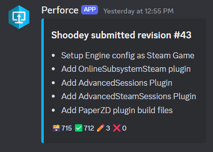

# Perfoce-Discord Integration

This is a simple Python script that can be used alongside Perforce triggers to send Discord messages when a change is submitted.

Below is an image of what the message looks like in Discord.



## Installation

1. Copy `.env.example` to `.env` and fill in the required fields.
2. Install the required packages with `pip install -r requirements.txt`.
3. Bind the script to the desired Perforce triggers.
4. ???
5. Profit

## Perforce Triggers

Add the following trigger to your Perforce servers by running `p4 triggers`.
Make sure to replace the placeholders with the correct values.

- `{Depot}`: The depot you want to monitor. `//...` for all depots, or a specific depot like `//home-depot/...`.
- `{Python}`: The path to the Python executable, usually `/usr/bin/python3` in Linux.
- `{Script}`: The path to the `perforce-discord-integration/src/app.py` script.

```bash
discord-integration change-submit {Depot} "{Python} {Script} %changelist%"
```

## Caveats

The script runs `p4 describe` to get the change information, so the user running the script must have the necessary permissions to run this command.
In addition, if the user running the script has a timeout set, it will cause the script to fail.

If you have limited seats and cannot have a dedicated user that can run the script, you can modify one of your existing ones to have unlimited timeout.

If you can afford a dedicated user, you can create a new one with the necessary permissions (for a/all depot(s)) and no timeout. In addition to only granting them read-only access to the depot from localhost only.

## Contribution

Feel free to contribute to this project by creating a pull request. I will do my best to review them in a timely manner.
